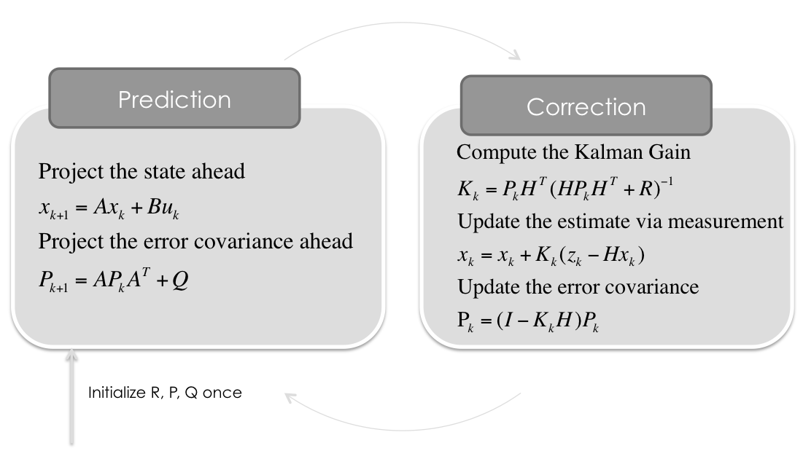

# Sensor Fusion using Extended Kalman Filter

The main goal of the project is to apply Extended Kalman Filter to fuse data from LiDAR and Radar sensors mounted on a self-driving vehicle (noisy environment). The pipeline is implemented using C++. 

For more details, please, check out the [source code directory](https://github.com/wafarag/EKF-Sensor-Fusion/tree/master/src) and the [testing data file](https://github.com/wafarag/EKF-Sensor-Fusion/blob/master/data/obj_pose-laser-radar-synthetic-input.txt). 
The results of the EKF fusion algorithm for:
* Both LiDAR and RADAR: RMS => [0.095871  0.0930713  0.295331  0.37495].
* For LiDAR alon: RMS => [0.181518  0.15348  0.474065  0.468911]. 
* For RADAR alone: RMS => [10.9225 7.92431 7.80318 6.49818].
